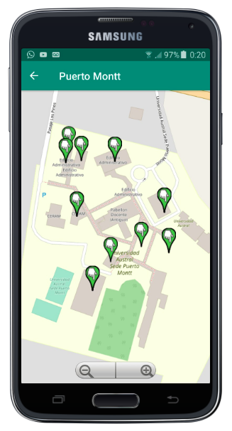

# Austral_app

### Descripción

Aplicación móvil para la geolocalización al interior de los campus de una determinada Universidad. Guía para los usuarios que necesitan buscar y encontrar rutas a diferentes ubicaciones que forman parte del ambiente Universitario. La aplicación móvil organiza la información que obtiene por medio de la API `Austral_api` a través de Campus, en cada Campus se puede buscar personas por el filtrado de nombre u apellido, mientras que las unidades se pueden observar sobre un mapa, la busqueda entrega como resultado la ruta más corta desde la posición del usuario a la ubicación deseada, esto por medio de la implementación del `Dijkstra_algoritmo`. Todos los resultados son presentados sobre mapas de las instalaciones de las Sedes. 

### Construcción / Modificación

``` bash
- Cambiar el atributo BASE_URL, ubicado en API/APIClient.java por la ruta base de su API Austral_api.
- Construir apk
```

### Imágenes de demostración

